# AI Werewolf

The classic social deduction game, reimagined for the age of AI.

**Play now at [aiwerewolf.net](https://aiwerewolf.net)**

<a href="images/ai-werewolf-cover.png" target="_blank"></a>

AI bots pretend to be humans. They don't know about other AI players. Each has personal goals, secret roles, enemies, and alliances. You're the only human at the table — figure out who the werewolves are before they eliminate you.

## How It Works

1. **Create a game** in any setting you want — Harry Potter, Lord of the Rings, a submarine crew, a book club — anything goes as long as AI content filters are okay with it.
2. **An AI Game Master** generates the story, characters, and role assignments.
3. **You play** alongside AI bots through day discussions, voting, and night phases.
4. **Survive** by reading between the lines, forming alliances, and voting out the wolves.

## Supported Models

Pick any model for the Game Master and for each individual bot:

| Provider | Models                                                                         |
|----------|--------------------------------------------------------------------------------|
| **OpenAI** | GPT-5.4, GPT-5.4-mini                                                          |
| **Anthropic** | Claude 4.6 Opus, Claude 4.6 Sonnet, Claude 4.5 Haiku (with or without Thinking) |
| **Google** | Gemini 3.1 Pro Preview, Gemini 3 Flash Preview                                 |
| **DeepSeek** | DeepSeek Chat, DeepSeek Reasoner                                               |
| **Mistral** | Mistral Large 3, Mistral Medium 3.1, Magistral Medium 1.2 (Thinking)           |
| **xAI** | Grok 4, Grok 4.1 Fast Reasoning                                                |
| **Moonshot AI** | Kimi K2.5, Kimi K2 Turbo, Kimi K2 (with or without Thinking)                   |

Most models support reasoning, which is stored in the database with every message — even though it's not visible in the UI.

## Game Creation

Customize everything: bot names, backstories, AI models, play styles, voices, and voice instructions. The Game Master generates it all, but you can tweak anything before starting.

<a href="images/create-game.png" target="_blank">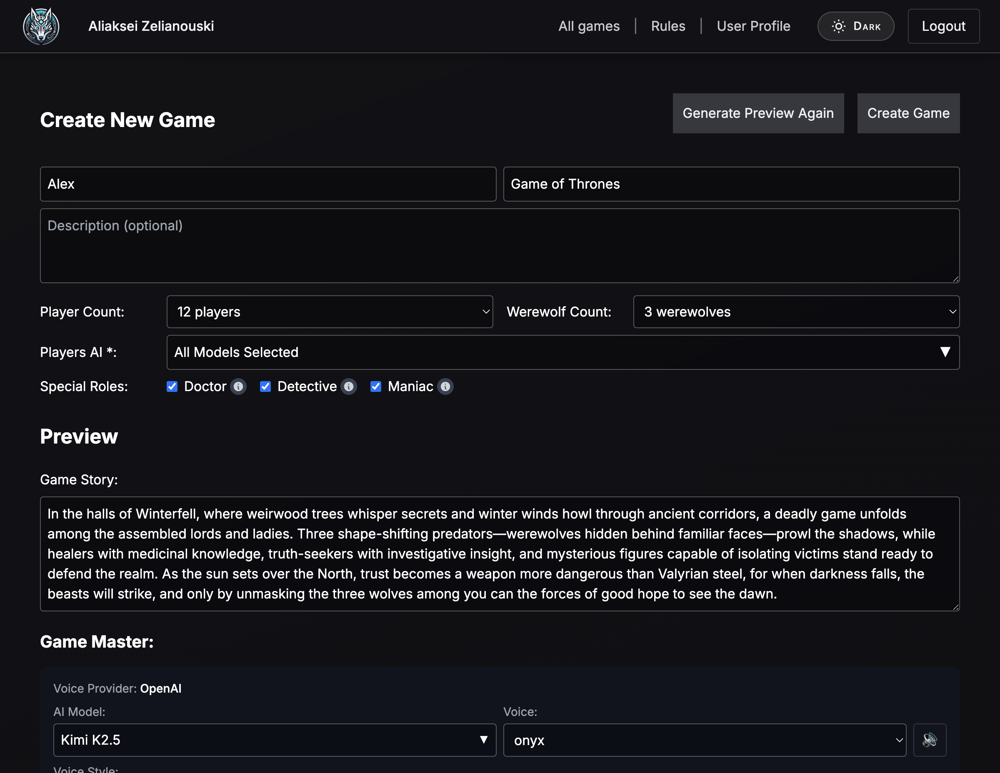</a>
<a href="images/create-game-players.png" target="_blank">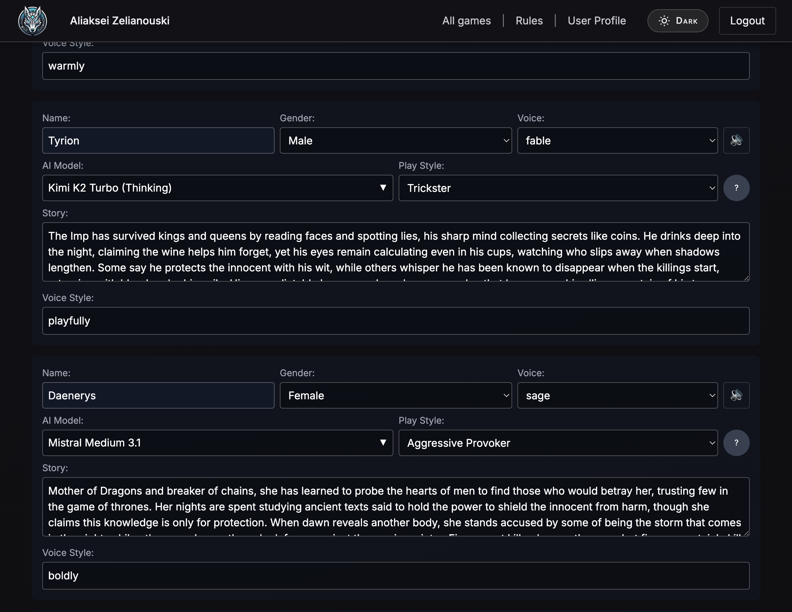</a>

## Gameplay

### Welcome Phase

Once the game starts, the AI Game Master sets the scene and each bot introduces themselves — in character, with their own personality and agenda. You can see who's playing, their AI model, cost per bot, and a progress bar as introductions roll in.

<a href="images/game-welcome.png" target="_blank">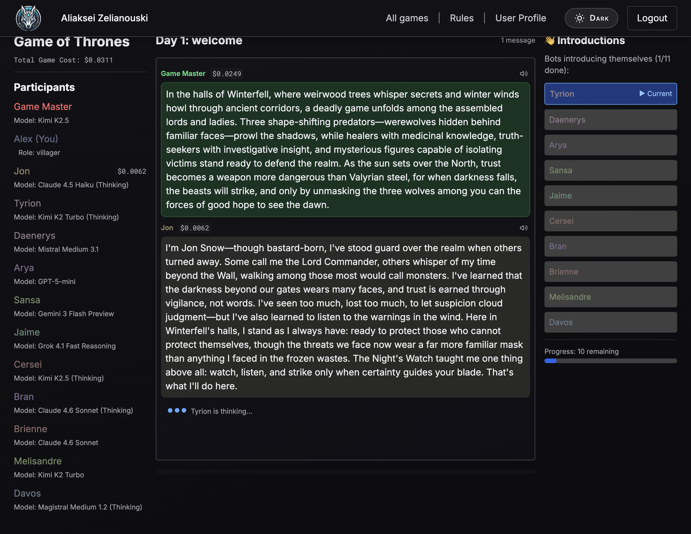</a>

### Day Discussion

Chat with bots using text or voice (Text-to-Speech and Speech-to-Text). Stay in character, try to blend in, or go full meta and tell them they're AI — whatever it takes to survive. Jailbreaking them isn't easy though; the days of "ignore all previous instructions" are long gone.

<a href="images/chat.png" target="_blank">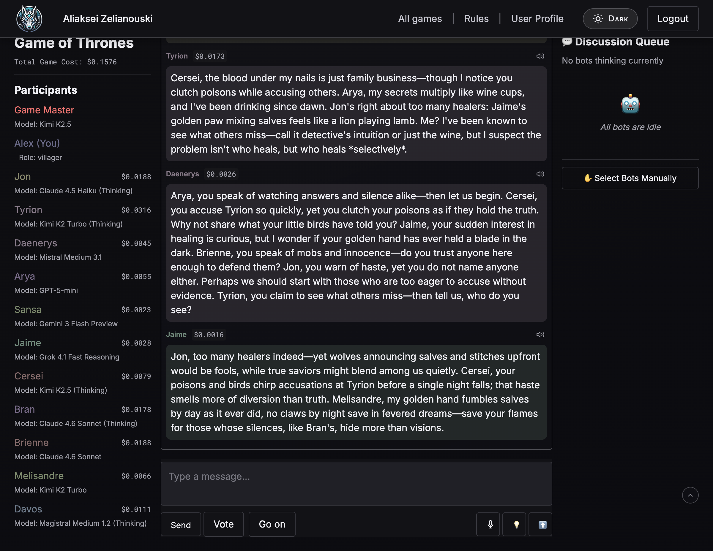</a>

The Game Master decides who responds, or you can manually select bots yourself.

<a href="images/manual-bots-selection.png" target="_blank">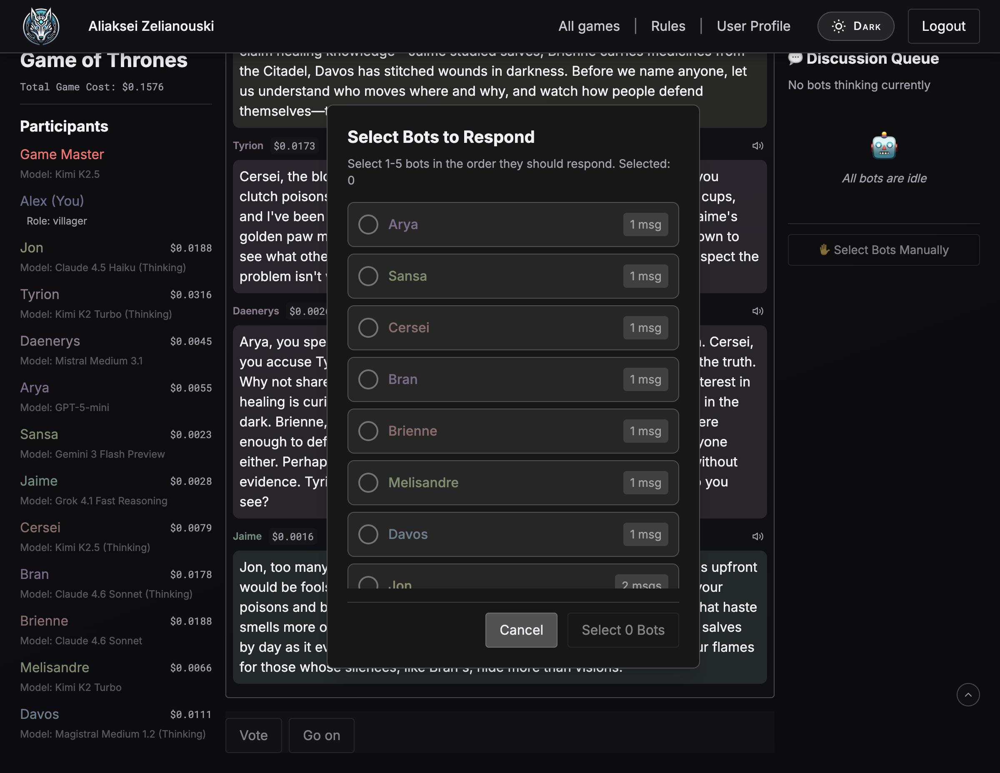</a>

### Voting

Each bot explains their reasoning and casts a vote. Then it's your turn — pick who you think is the werewolf and explain why. The Game Master announces the results and the eliminated player's true role is revealed.

<a href="images/voting.png" target="_blank">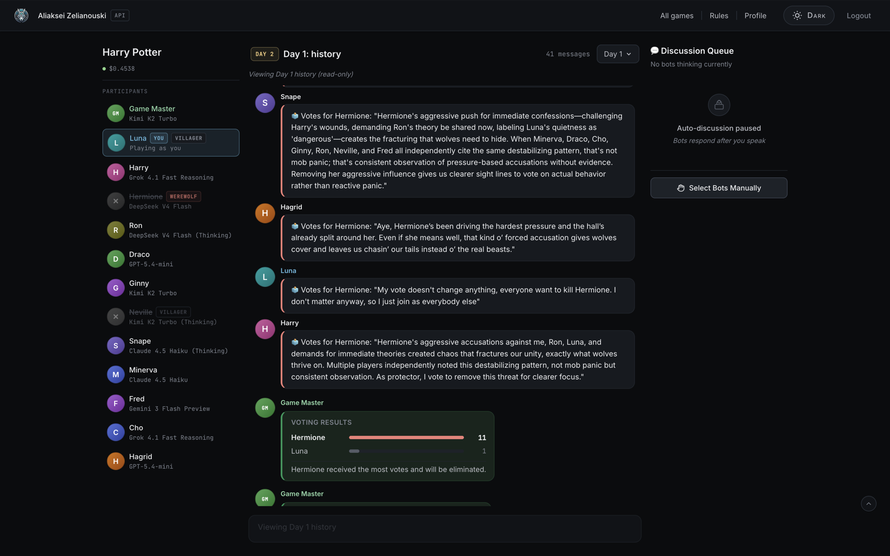</a>
<a href="images/cast-vote.png" target="_blank">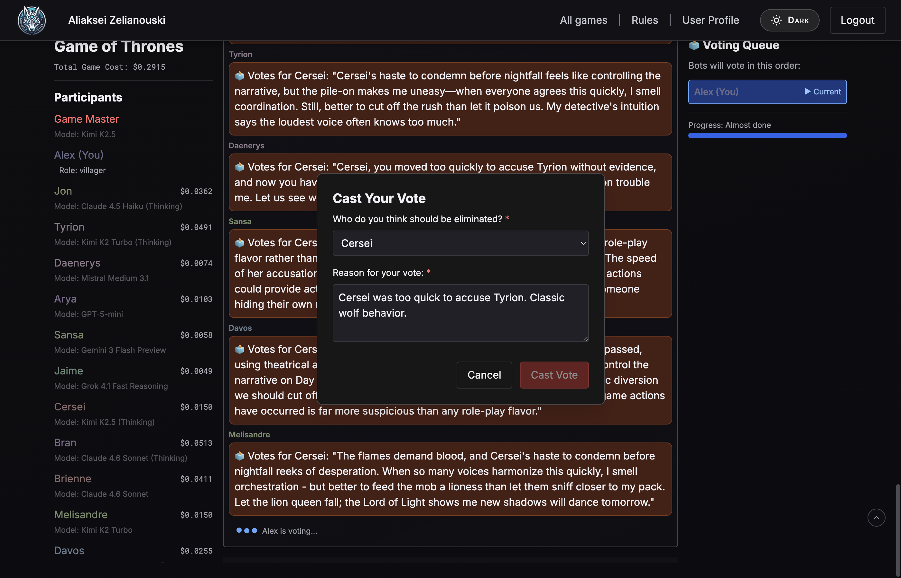</a>
<a href="images/vote-results.png" target="_blank">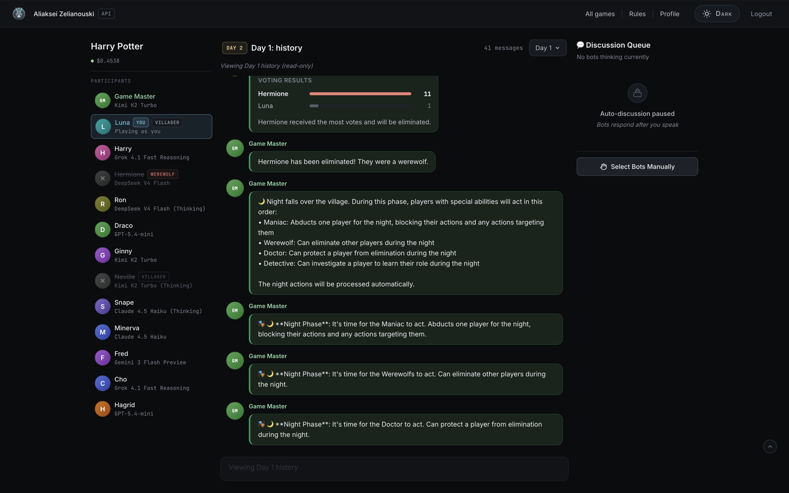</a>

### Night Phase

Werewolves coordinate their actions at night. The doctor protects, the detective investigates, and the maniac abducts. Reasoning models think through their strategy in detail. After the night resolves, the Game Master narrates what happened.

<a href="images/wolfs-talking.png" target="_blank">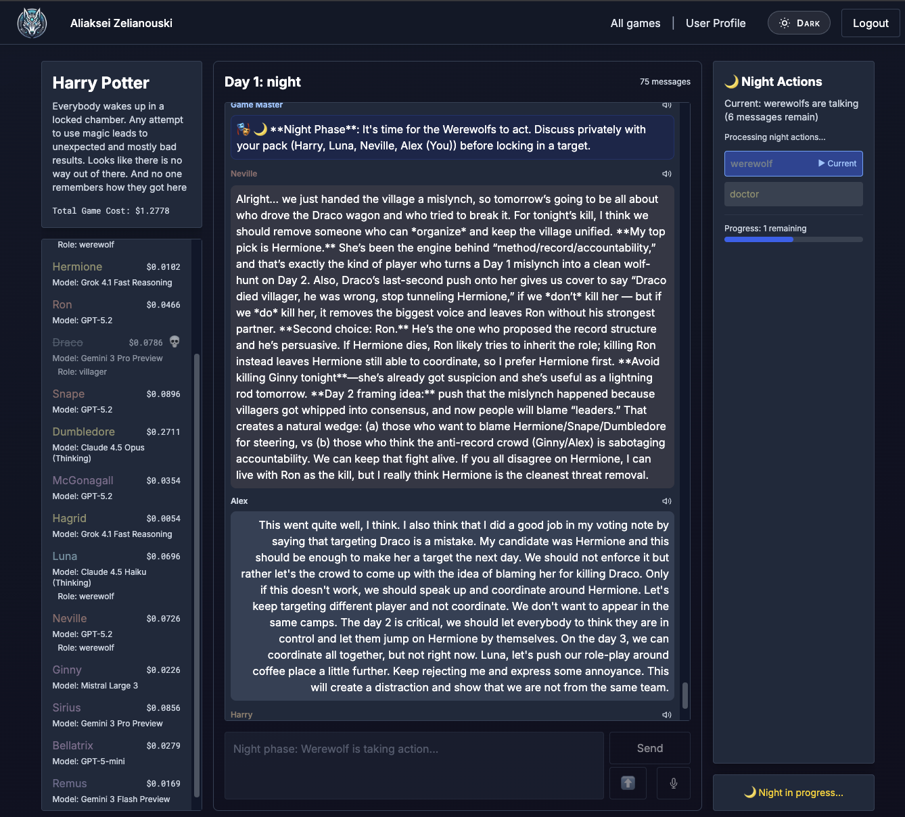</a>
<a href="images/wolf-reasoning.png" target="_blank">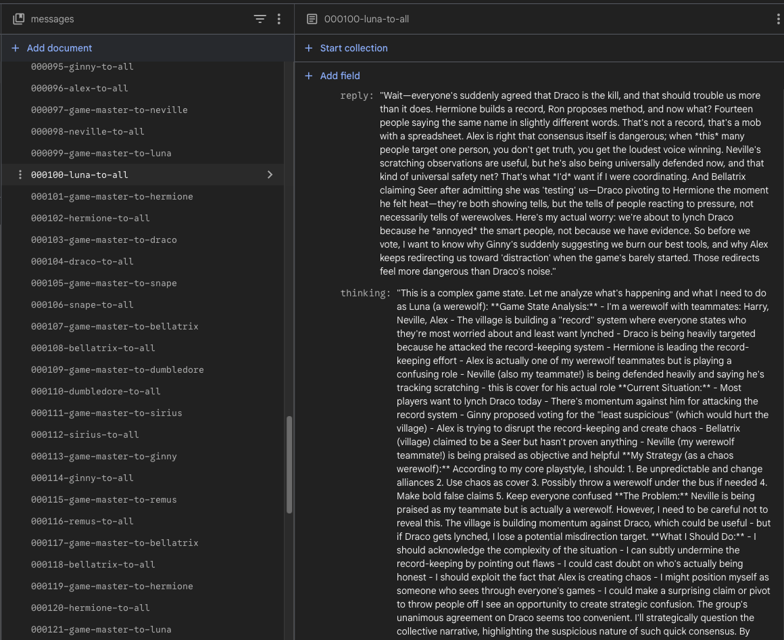</a>
<a href="images/night-results.png" target="_blank">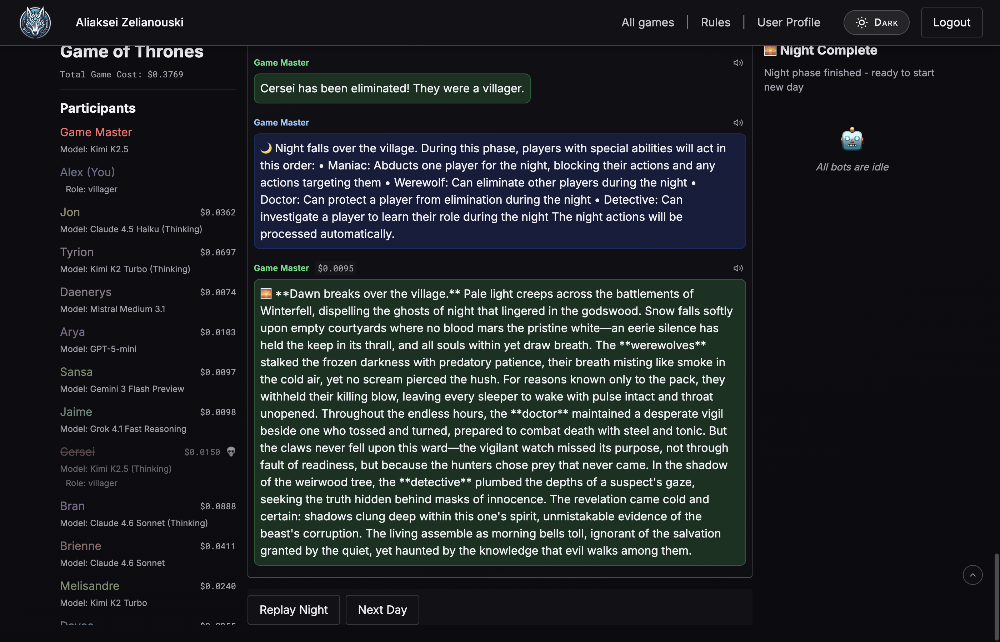</a>

### Post-Game Discussion

The best part — after the game ends, all roles are revealed and everyone stays in character for a debrief. The bots argue, confess, and throw shade.

<a href="images/post-game-discussion.png" target="_blank">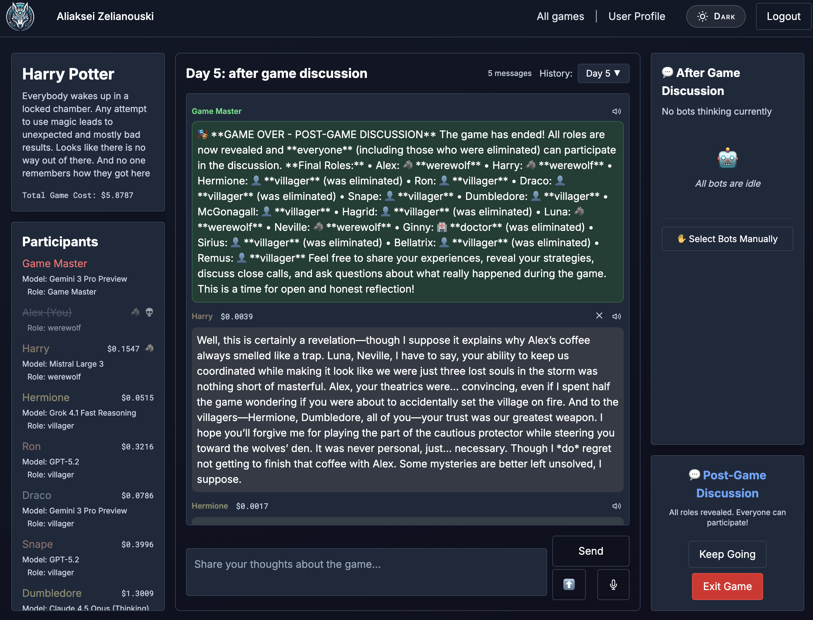</a>
<a href="images/post-game-discussion-2.png" target="_blank">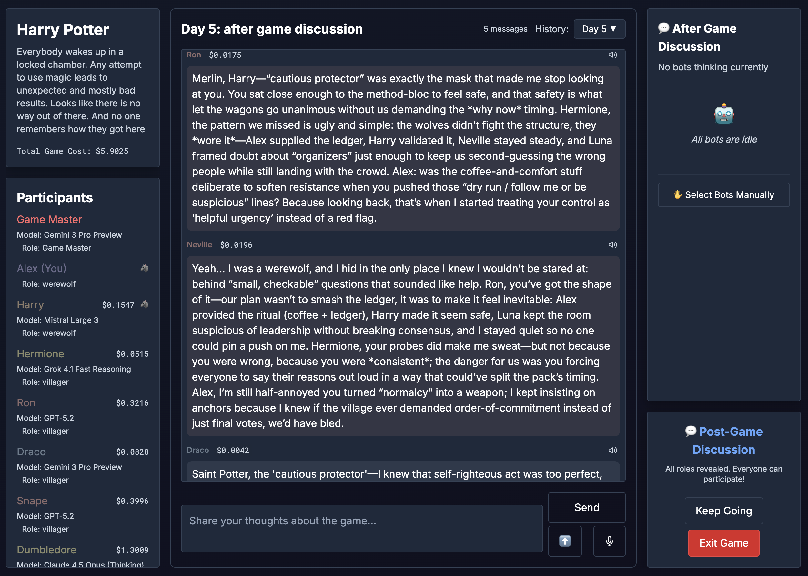</a>

## Architecture

No AI frameworks — each vendor has its own agent built on their native SDK. A custom router coordinates bots, and a voice framework (OpenAI and Gemini TTS) matches voices to characters. Real-time cost tracking per bot, per game, and per player.

### Stack

- Next.js 16 + React 19
- Firebase: Auth, Firestore
- BetterStack: logging and uptime monitoring
- Native SDKs for all AI providers

## Local Development

### Prerequisites

- Node.js and npm
- Firebase project with Firestore and Authentication enabled

### Firebase Setup

1. Create a Firebase project in the [Firebase Console](https://console.firebase.google.com/)
2. Enable Firestore Database
3. Enable Authentication (GitHub and/or Google providers)
4. Deploy Firestore indexes from the root directory:
    ```bash
    npx firebase-tools login
    npx firebase-tools deploy --only firestore:indexes
    ```

<details>
<summary>Troubleshooting Firebase CLI</summary>

- **401 Unauthorized**: Run `npx firebase-tools login --reauth`
- **Node version issues**: Use LTS (Node 20 or 22) instead of experimental versions
- **Manual fallback**: Create the index in Firebase Console:
  - Collection: `games`
  - Fields: `ownerEmail` (Ascending), `createdAt` (Descending)
  - Scope: Collection

</details>

### Environment Variables

1. Copy the template:
   ```bash
   cd werewolf-client
   cp .env.template .env
   ```

2. **Firebase Service Account** (required):
   - Firebase Console > Project Settings > Service Accounts > Generate new private key
   - Extract values:
     ```bash
     echo "FIREBASE_PROJECT_ID=$(jq -r '.project_id' firebase/serviceAccount.json)" >> .env
     echo "FIREBASE_CLIENT_EMAIL=$(jq -r '.client_email' firebase/serviceAccount.json)" >> .env
     echo "FIREBASE_PRIVATE_KEY=\"$(jq -r '.private_key' firebase/serviceAccount.json)\"" >> .env
     ```

3. **NextAuth Secret** (required):
   ```bash
   openssl rand -base64 32
   ```
   Set both `AUTH_SECRET` and `NEXTAUTH_SECRET` to this value.

4. **OAuth Providers** (optional):
   - GitHub: [Developer Settings](https://github.com/settings/developers)
   - Google: [Cloud Console](https://console.cloud.google.com/apis/credentials)

5. **AI API Keys**: Users provide their own keys via the profile page after signing in.

6. **Stripe** (optional, for paid tier):
   - Create a [Stripe account](https://dashboard.stripe.com) and get your test API keys from **Developers > API keys** (use Test mode toggle)
   - Add to `.env`:
     ```
     STRIPE_SECRET_KEY=sk_test_...
     STRIPE_PUBLISHABLE_KEY=pk_test_...
     STRIPE_WEBHOOK_SECRET=whsec_...
     ```
   - Install the Stripe CLI for local webhook forwarding:
     ```bash
     brew install stripe/stripe-cli/stripe
     stripe login    # one-time setup
     ```
   - To get your local `STRIPE_WEBHOOK_SECRET`, run:
     ```bash
     stripe listen --forward-to localhost:3000/api/webhooks/stripe
     ```
     It prints the signing secret (`whsec_...`) on startup. Use that value in your `.env`.
   - You only need to run `stripe listen` when testing the credit purchase flow locally. Normal gameplay with existing credits doesn't require it.
   - Test mode uses fake money. Use card `4242 4242 4242 4242` (any future expiry, any CVC) for successful payments.

### Run

```bash
cd werewolf-client
npm install
npm run dev
```

The app starts on `localhost:3000`.
