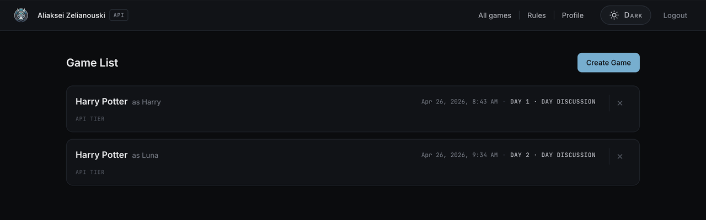
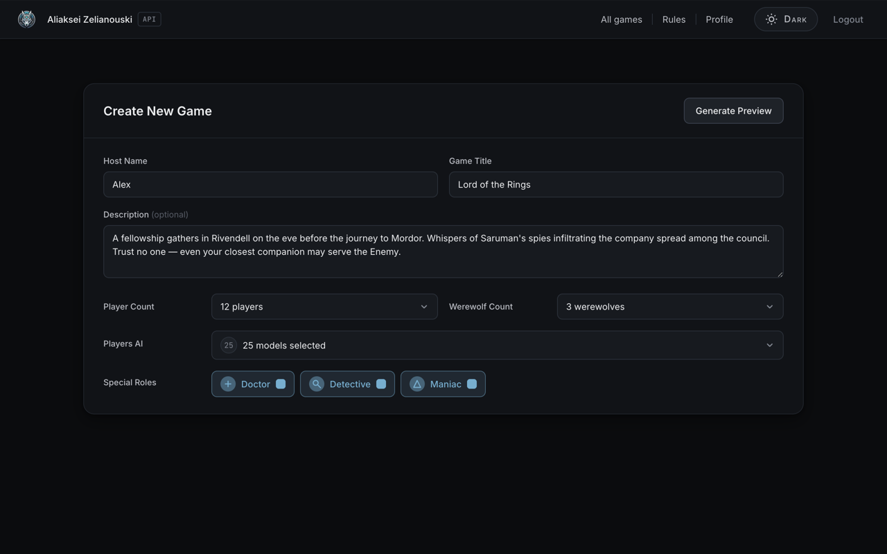
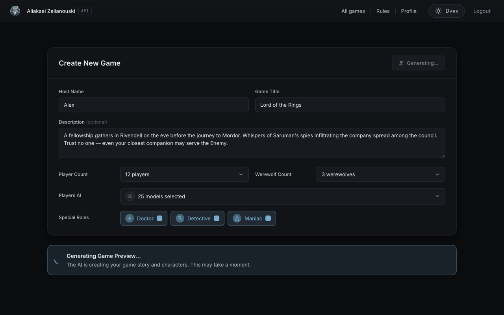
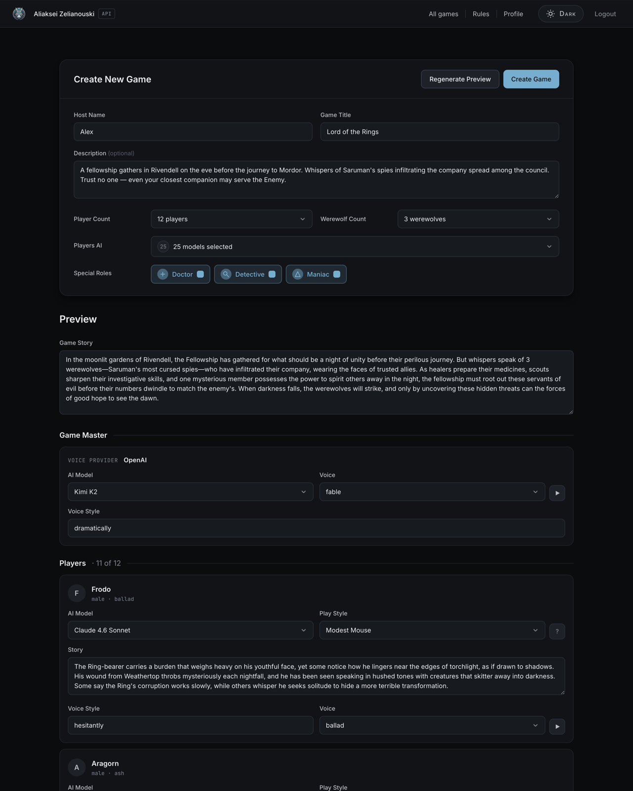
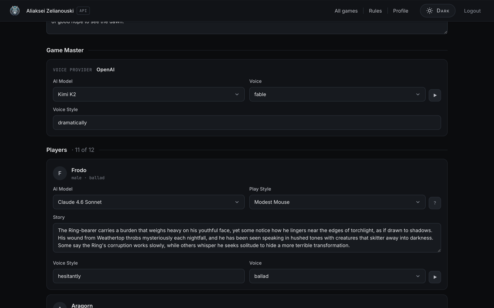
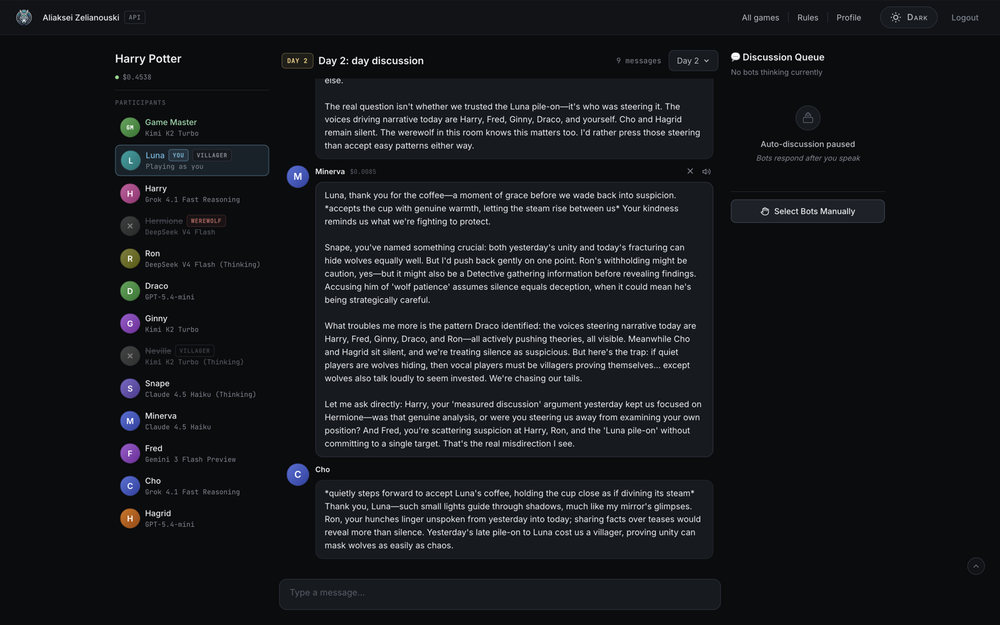
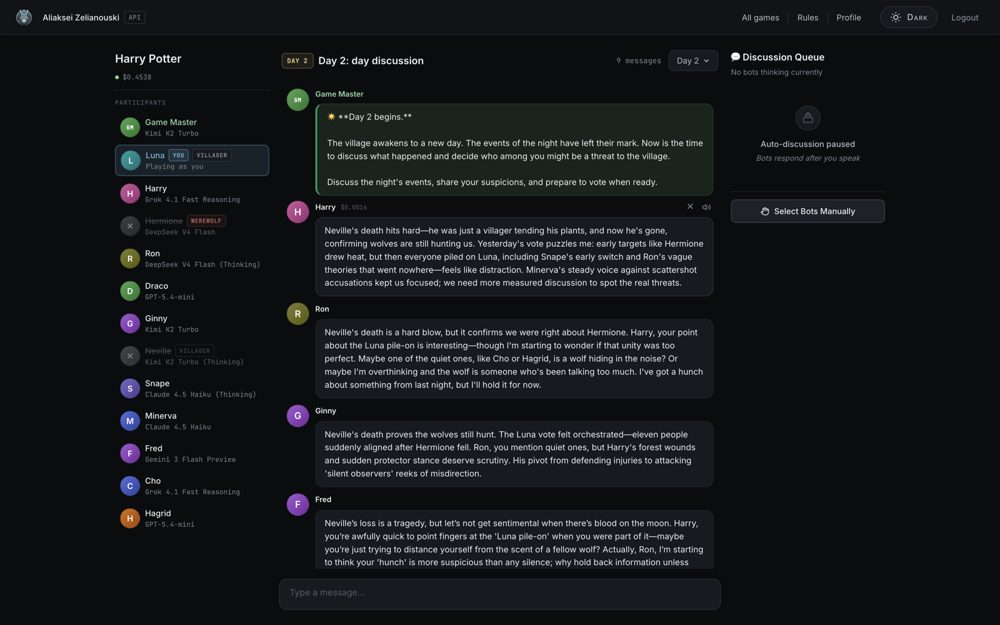
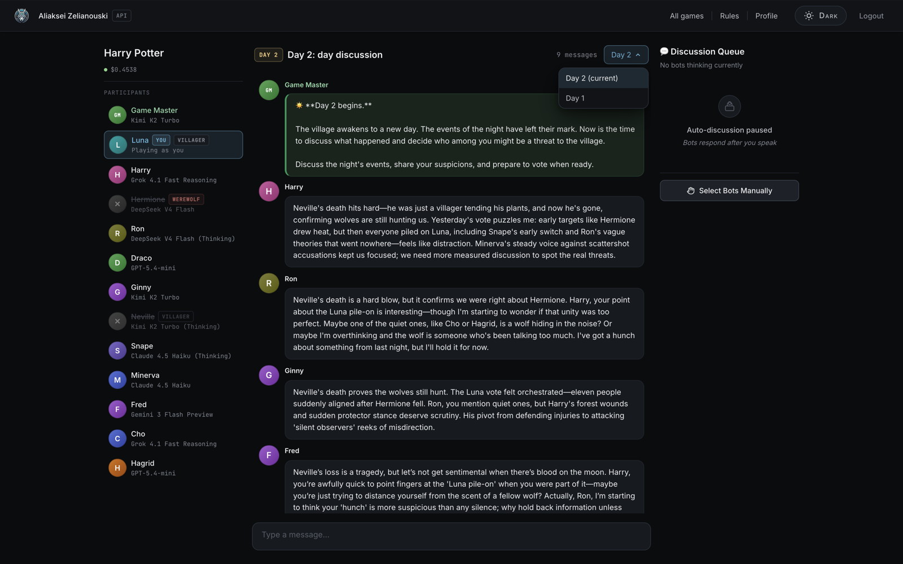
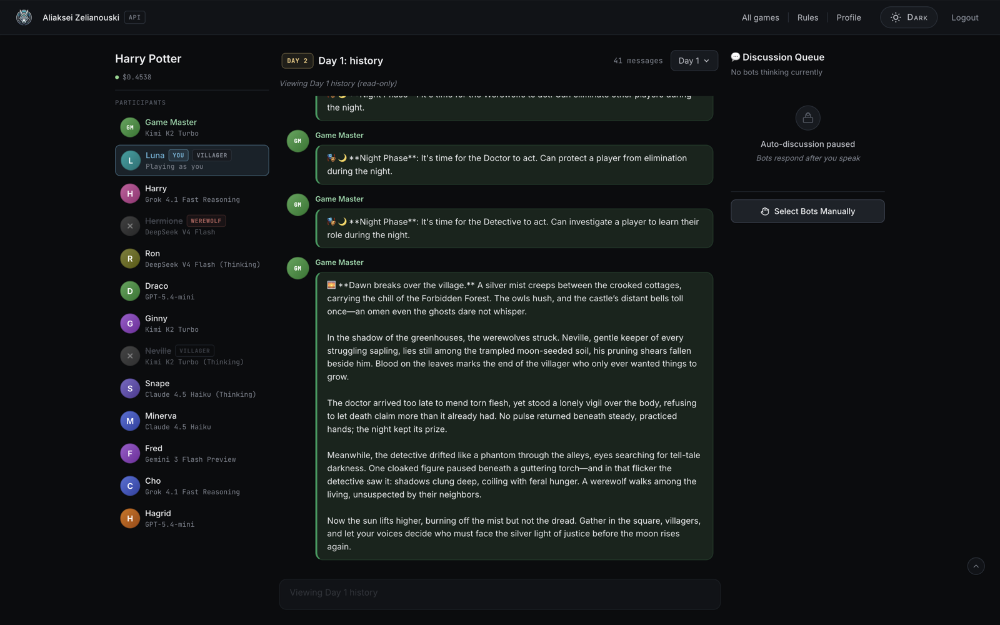

# AI Werewolf

The classic social deduction game, reimagined for the age of AI.

**Play now at [aiwerewolf.net](https://aiwerewolf.net)**

<a href="images/ai-werewolf-cover.png" target="_blank"></a>

AI bots pretend to be humans. They don't know about other AI players. Each has personal goals, secret roles, enemies, and alliances. You're the only human at the table — figure out who the werewolves are before they eliminate you.

## How It Works

1. **Create a game** in any setting you want — Harry Potter, Lord of the Rings, a submarine crew, a book club — anything goes as long as AI content filters are okay with it.
2. **An AI Game Master** generates the story, characters, and role assignments.
3. **You play** alongside AI bots through day discussions, voting, and night phases.
4. **Survive** by reading between the lines, forming alliances, and voting out the wolves.

## Supported Models

Pick any model for the Game Master and for each individual bot:

| Provider | Models                                                                         |
|----------|--------------------------------------------------------------------------------|
| **OpenAI** | GPT-5.5, GPT-5.4-mini                                                          |
| **Anthropic** | Claude 4.7 Opus, Claude 4.6 Sonnet, Claude 4.5 Haiku (with or without Thinking) |
| **Google** | Gemini 3.1 Pro Preview, Gemini 3 Flash Preview                                 |
| **DeepSeek** | DeepSeek V4 Flash, DeepSeek V4 Pro (with or without Thinking)                  |
| **Mistral** | Mistral Large 3, Mistral Medium 3.5, Mistral 4 Small, Magistral Medium 1.2 (Thinking) |
| **xAI** | Grok 4.3, Grok 4.1 Fast Reasoning                                               |
| **Moonshot AI** | Kimi K2.6 (with or without Thinking)                                           |
| **Z.AI** | GLM-5.1 (with or without Thinking)                                              |

Most models support reasoning, which is stored in the database with every message — even though it's not visible in the UI.

## Game List

After signing in, the Game List shows every game you've started — theme, the character you're playing, the current day, and the phase.

<a href="images/game-list.png" target="_blank"></a>

## Game Creation

Click **Create Game** and pick a theme — Star Wars, a submarine crew, a Jane Austen novel, anything the AI content filters tolerate. Set player count (up to 12), werewolf count, the AI models bots can be drawn from, and which special roles to include.

<a href="images/create-game-form.png" target="_blank"></a>

`Generate Preview` kicks off the AI pipeline that writes the story, picks a Game Master config, and rolls every player. Generating 11–12 player configs against a slower model takes 60–90s — a polite blue toast tells you it's working.

<a href="images/generating-preview.png" target="_blank"></a>

When the call returns, the **Preview** section appears below the form: AI-written game story, then the Game Master config (model, voice, voice style).

<a href="images/preview-story-gm.png" target="_blank"></a>

Below that, every player has its own card — name, gender, AI model, play style, backstory, voice, and voice style. Anything can be tweaked before clicking **Create Game**.

<a href="images/preview-players.png" target="_blank"></a>

## Gameplay

The in-game screen is three columns:

- **Left** — participants with the Game Master at the top, then players. The human is highlighted as `YOU`. Each row shows the assigned AI model, and the total game cost so far sits next to the title.
- **Center** — chat. Game Master messages, player dialogue, and votes scroll here. The Day selector at the top right lets you jump between days.
- **Right** — discussion queue. Live status of who's thinking, plus a **Select Bots Manually** button to override the GM and pick which 1–5 bots speak next.

<a href="images/game-luna.png" target="_blank"></a>

### Day Discussion

The AI Game Master opens each day, then the bots pile in with their analysis. Chat with them using text or voice (TTS/STT). Stay in character, try to blend in, or go full meta and tell them they're AI — whatever it takes to survive. Jailbreaking isn't easy; the days of "ignore all previous instructions" are long gone.

<a href="images/day-discussion.png" target="_blank"></a>

### Day History

The Day selector at the top right opens a dropdown of every day played so far. Past days load in **read-only history mode** — full transcript, no input box.

<a href="images/day-selector.png" target="_blank"></a>

<a href="images/day-history.png" target="_blank"></a>

### Voting

Once voting starts, each bot posts a `🗳️ Votes for X` message with their reasoning. The human gets a Cast Your Vote modal — pick a player from the dropdown and write a reason (required).

<a href="images/voting.png" target="_blank"></a>

After all votes are in, the Game Master posts a tally chart and announces the elimination — and the eliminated player's true role is revealed.

<a href="images/vote-results.png" target="_blank"></a>

### Night Phase

Werewolves coordinate privately, the doctor protects, the detective investigates, and the maniac abducts. Reasoning models think through their strategy in detail. The Game Master narrates the results at dawn.

### Post-Game Discussion

When the game ends — werewolves wiped out, or werewolves outnumbering villagers — all roles are revealed and the bots stay in character for a debrief. They argue, confess, and throw shade.

## Architecture

No AI frameworks — each vendor has its own agent built on their native SDK. A custom router coordinates bots, and a voice framework (OpenAI and Gemini TTS) matches voices to characters. Real-time cost tracking per bot, per game, and per player.

### Stack

- Next.js 16 + React 19
- Firebase: Auth, Firestore
- BetterStack: logging and uptime monitoring
- Native SDKs for all AI providers

## Local Development

### Prerequisites

- Node.js and npm
- Firebase project with Firestore and Authentication enabled

### Firebase Setup

1. Create a Firebase project in the [Firebase Console](https://console.firebase.google.com/)
2. Enable Firestore Database
3. Enable Authentication (GitHub and/or Google providers)
4. Deploy Firestore indexes from the root directory:
    ```bash
    npx firebase-tools login
    npx firebase-tools deploy --only firestore:indexes
    ```

<details>
<summary>Troubleshooting Firebase CLI</summary>

- **401 Unauthorized**: Run `npx firebase-tools login --reauth`
- **Node version issues**: Use LTS (Node 20 or 22) instead of experimental versions
- **Manual fallback**: Create the index in Firebase Console:
  - Collection: `games`
  - Fields: `ownerEmail` (Ascending), `createdAt` (Descending)
  - Scope: Collection

</details>

### Environment Variables

1. Copy the template:
   ```bash
   cd werewolf-client
   cp .env.template .env
   ```

2. **Firebase Service Account** (required):
   - Firebase Console > Project Settings > Service Accounts > Generate new private key
   - Extract values:
     ```bash
     echo "FIREBASE_PROJECT_ID=$(jq -r '.project_id' firebase/serviceAccount.json)" >> .env
     echo "FIREBASE_CLIENT_EMAIL=$(jq -r '.client_email' firebase/serviceAccount.json)" >> .env
     echo "FIREBASE_PRIVATE_KEY=\"$(jq -r '.private_key' firebase/serviceAccount.json)\"" >> .env
     ```

3. **NextAuth Secret** (required):
   ```bash
   openssl rand -base64 32
   ```
   Set both `AUTH_SECRET` and `NEXTAUTH_SECRET` to this value.

4. **OAuth Providers** (optional):
   - GitHub: [Developer Settings](https://github.com/settings/developers)
   - Google: [Cloud Console](https://console.cloud.google.com/apis/credentials)

5. **AI API Keys**: Users provide their own keys via the profile page after signing in.

6. **Stripe** (optional, for paid tier):
   - Create a [Stripe account](https://dashboard.stripe.com) and get your test API keys from **Developers > API keys** (use Test mode toggle)
   - Add to `.env`:
     ```
     STRIPE_SECRET_KEY=sk_test_...
     STRIPE_PUBLISHABLE_KEY=pk_test_...
     STRIPE_WEBHOOK_SECRET=whsec_...
     ```
   - Install the Stripe CLI for local webhook forwarding:
     ```bash
     brew install stripe/stripe-cli/stripe
     stripe login    # one-time setup
     ```
   - To get your local `STRIPE_WEBHOOK_SECRET`, run:
     ```bash
     stripe listen --forward-to localhost:3000/api/webhooks/stripe
     ```
     It prints the signing secret (`whsec_...`) on startup. Use that value in your `.env`.
   - You only need to run `stripe listen` when testing the credit purchase flow locally. Normal gameplay with existing credits doesn't require it.
   - Test mode uses fake money. Use card `4242 4242 4242 4242` (any future expiry, any CVC) for successful payments.

### Run

```bash
cd werewolf-client
npm install
npm run dev
```

The app starts on `localhost:3000`.
