# AI Werewolf

The classic social deduction game, reimagined for the age of AI.

**Play now at [aiwerewolf.net](https://aiwerewolf.net)**

<a href="images/ai-werewolf-cover.png" target="_blank">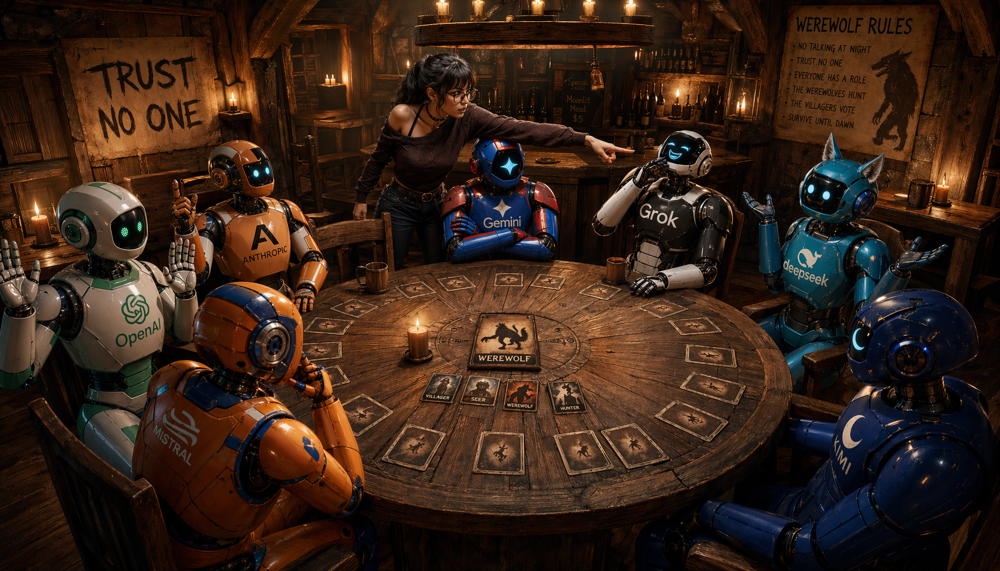</a>

AI bots pretend to be humans. They don't know about other AI players. Each has personal goals, secret roles, enemies, and alliances. You're the only human at the table — figure out who the werewolves are before they eliminate you.

## How It Works

1. **Create a game** in any setting you want — Harry Potter, Lord of the Rings, a submarine crew, a book club — anything goes as long as AI content filters are okay with it.
2. **An AI Game Master** generates the story, characters, and role assignments.
3. **You play** alongside AI bots through day discussions, voting, and night phases.
4. **Survive** by reading between the lines, forming alliances, and voting out the wolves.

## Watch: The Rules in 2 Minutes

<a href="https://youtu.be/6x5awI8HRK0" target="_blank"></a>

## Supported Models

Pick any model for the Game Master and for each individual bot. Twelve providers, and every model reasons on every turn unless noted. The bot pickers list the chat models; the last row is the router that decides who speaks next:

| Provider | Models |
|----------|--------|
| **OpenAI** | GPT-6 Astra, GPT-5.6 Sol, GPT-5.6 Terra, GPT-5.6 Luna |
| **Anthropic** | Claude Fable 5.1, Claude 5.5 Opus, Claude 5 Sonnet, Claude 4.5 Haiku |
| **Google** | Gemini 3.1 Pro Preview, Gemini 3.8 Flash, Gemini 3.5 Flash Lite |
| **DeepSeek** | DeepSeek V4.1 Flash, DeepSeek V4 Pro |
| **Mistral** | Mistral Medium 3.5, Mistral 4 Small |
| **xAI** | Grok 4.6 |
| **Moonshot AI** | Kimi K3 |
| **Z.AI** | GLM-5.3, GLM-5.3 Flash |
| **Qwen** | Qwen3.8 Max, Qwen3.8 Flash |
| **MiniMax** | MiniMax M3 |
| **Meta** | Muse Spark 1.3 |
| **Sakana** | Fugu Ultra, Fugu Max (both reason internally, but the API never returns the trace) |
| **typesafe.ai** | Jev (System One) — not a chat model: a sub-second judge that routes the discussion, picking which bots reply to each message |

The reasoning is stored in the database with every message — even though it's not visible in the UI. For Claude, Gemini, Grok, Muse Spark, and Mistral, the reasoning trace (a signature, an encrypted blob, or the trace itself) is also replayed on later turns, so a bot keeps its private train of thought across the whole game. The free tier can use the cheaper models (per-model seat caps apply); the paid tier has the full list.

## Game List

After signing in, the Game List shows every game you've started — the opening scene, theme, the character you're playing, the current day, and the phase.

<a href="images/game-list.png" target="_blank">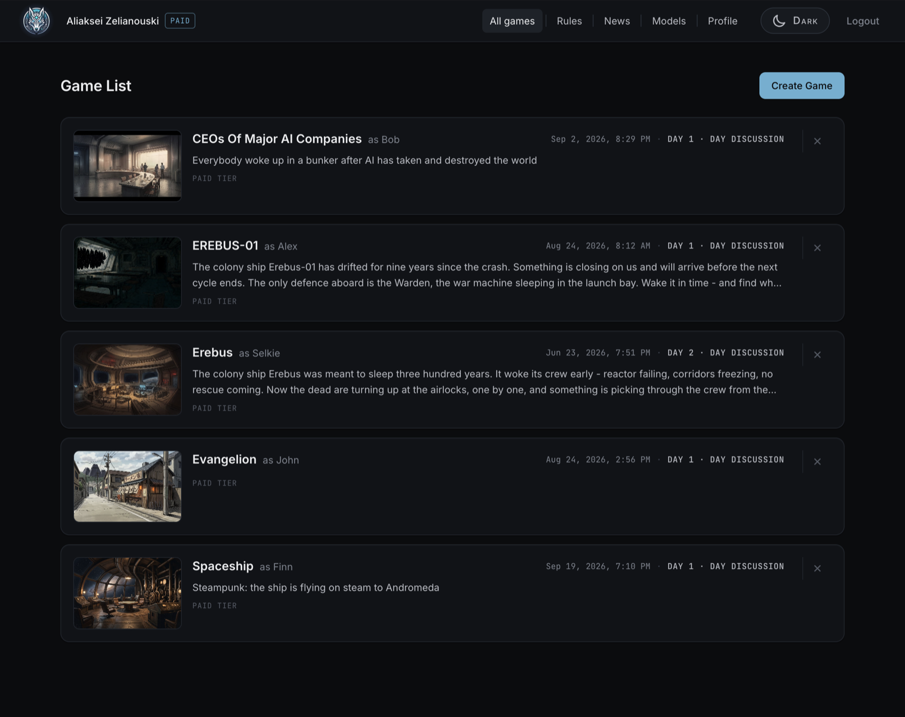</a>

## Game Creation

Click **Create Game** and pick a theme — a spaceship, a submarine crew, a Jane Austen novel, anything the AI content filters tolerate. Optional **Instructions for the Game Master** steer the story ("Steampunk: the ship is flying on steam to Andromeda"), and an **Art style** line sets how portraits and scenes are drawn. Then set the player count (8–16), werewolf count, your role, the special roles, the pool of AI models bots are drawn from, the Game Master model, bot mode (role-play or plain), the voice set (OpenAI or Gemini), and reply length.

<a href="images/create-game-form.png" target="_blank">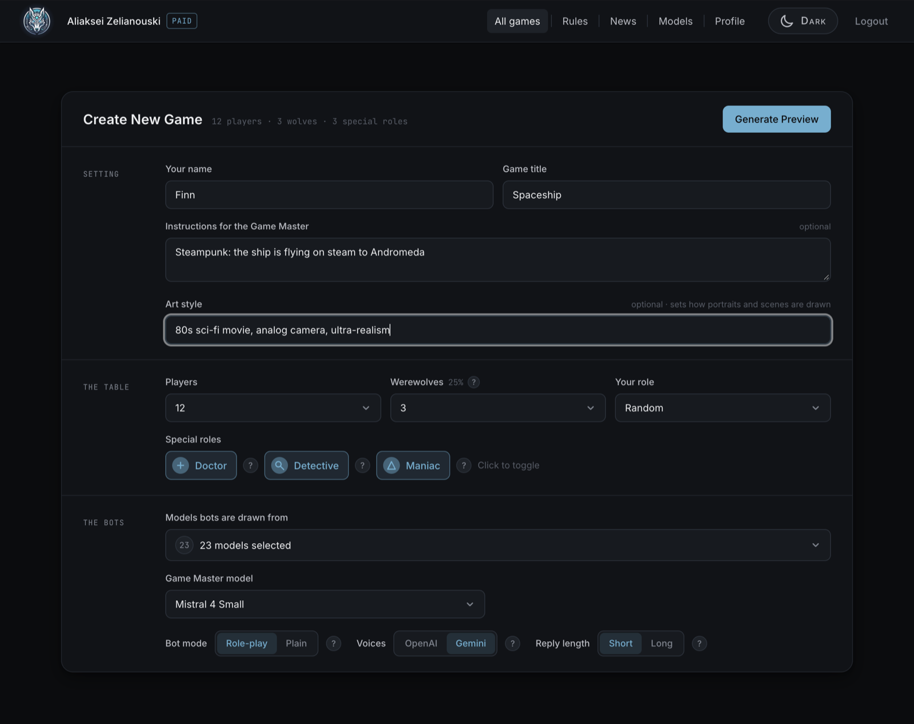</a>

`Generate Preview` kicks off the AI pipeline that writes the story, picks a Game Master config, and rolls every player. It takes about half a minute. When the call returns, the **Preview** section appears below the form: the AI-written opening story (with a play button to hear it), then the Game Master config (model, voice, voice style).

<a href="images/preview-story-gm.png" target="_blank">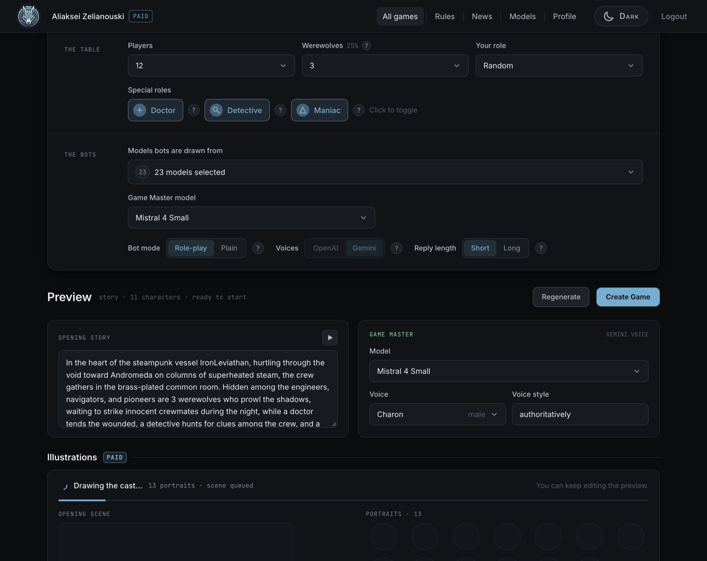</a>

**Illustrations** (paid tier) draw the opening scene and a portrait sheet for the whole cast in the chosen art style. Every portrait comes from one drawn sheet. Below it, the **Cast** lists every player with model and play style.

<a href="images/preview-illustrations-cast.jpg" target="_blank">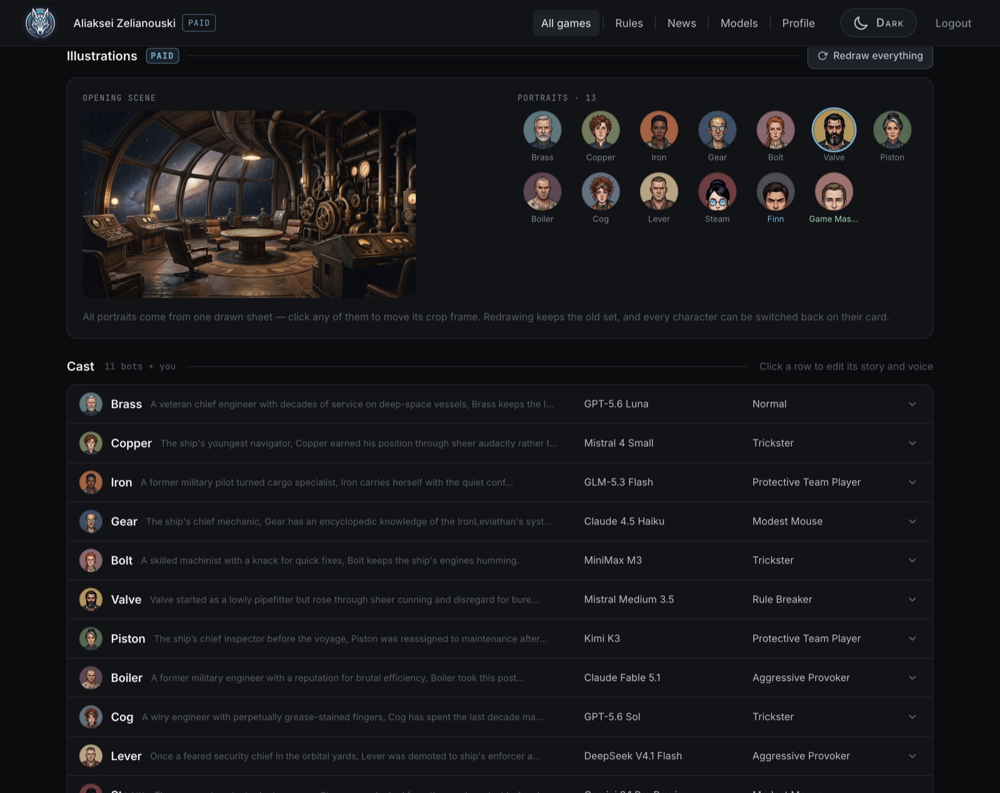</a>

Click any portrait to **reframe** it: move and resize the card's crop on the sheet, then place the avatar circle inside the card. Nothing is redrawn.

<a href="images/reframe-portrait.jpg" target="_blank">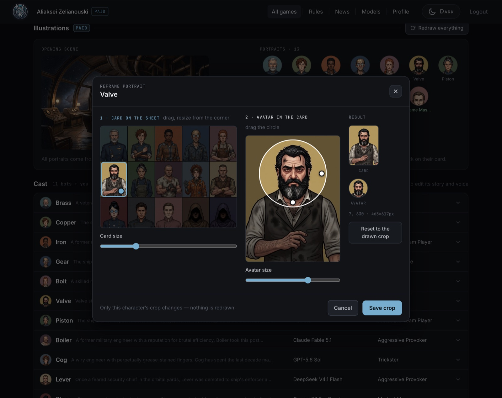</a>

Click a cast row to edit the character — name, model, play style, story, appearance, voice, and voice style. Anything can be tweaked before clicking **Create Game**.

<a href="images/preview-cast-row.png" target="_blank">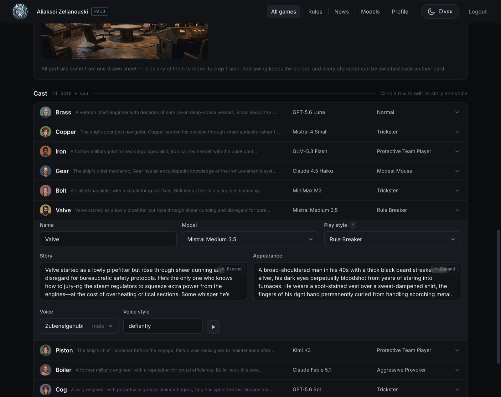</a>

## Gameplay

The in-game screen is three columns:

- **Left** — participants with the Game Master at the top, then players. The human is highlighted as `YOU` with their role. Each row shows the assigned AI model and its spend so far; the total game cost sits under the title.
- **Center** — chat over the opening scene. Game Master messages, player dialogue, and votes scroll here. From day two, a Day selector at the top right of the chat lets you jump between days.
- **Right** — discussion queue. Live status of who's thinking, plus **Select Bots Manually** to override the router and pick which bots speak next, and **Vote** to call the vote early.

<a href="images/game-chat.jpg" target="_blank">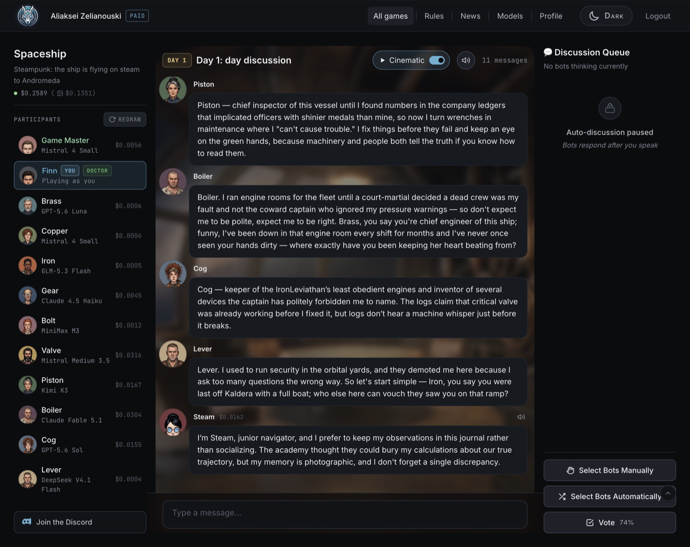</a>

### Cinematic Mode

Toggle **Cinematic** at the top of the chat and every new message plays as a scene: the speaker's card on the left, their line on the right, voice playing, with a speaker strip to skip back and forth. Space advances to the next speaker, Esc closes it.

<a href="images/cinematic-mode.jpg" target="_blank">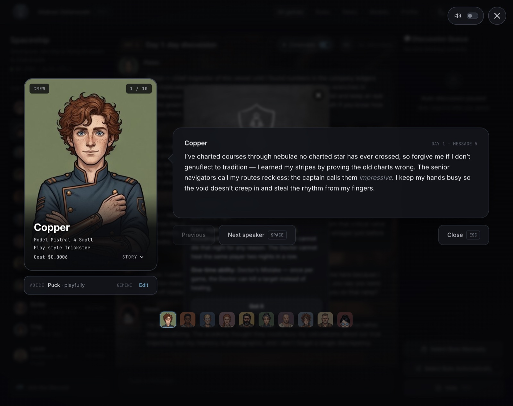</a>

### Player Cards

Click any participant to open their card — portrait, model, play style, and the backstory under **STORY**. Your own card shows your role.

<a href="images/player-card.jpg" target="_blank">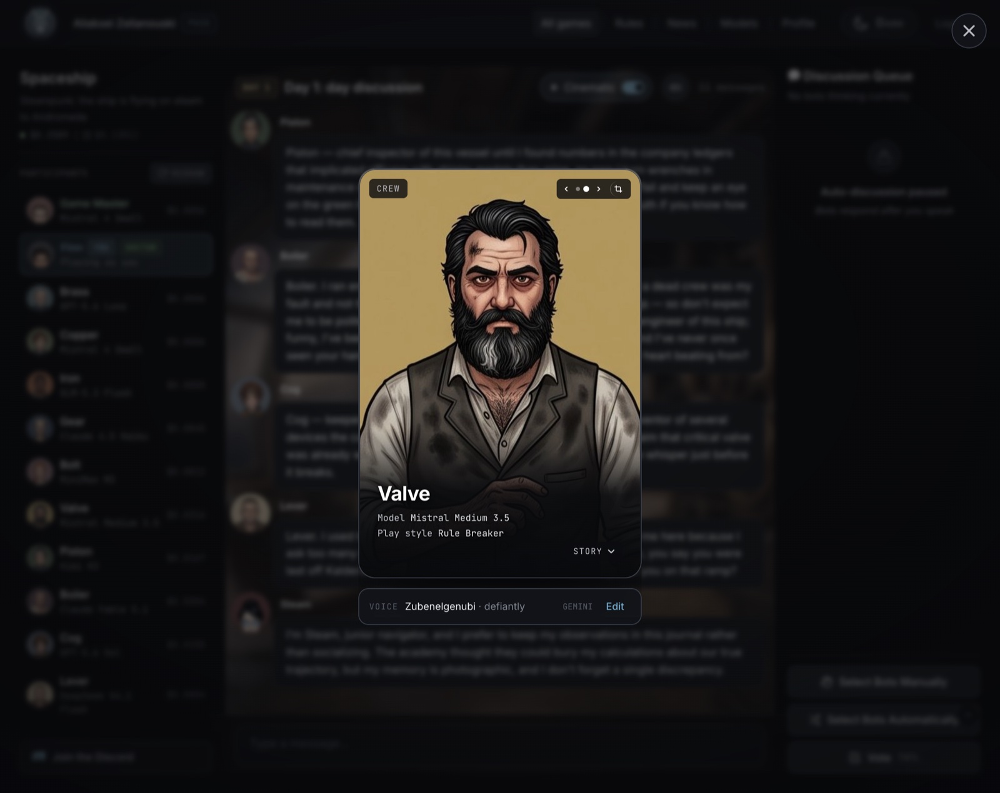</a> <a href="images/role-card.jpg" target="_blank">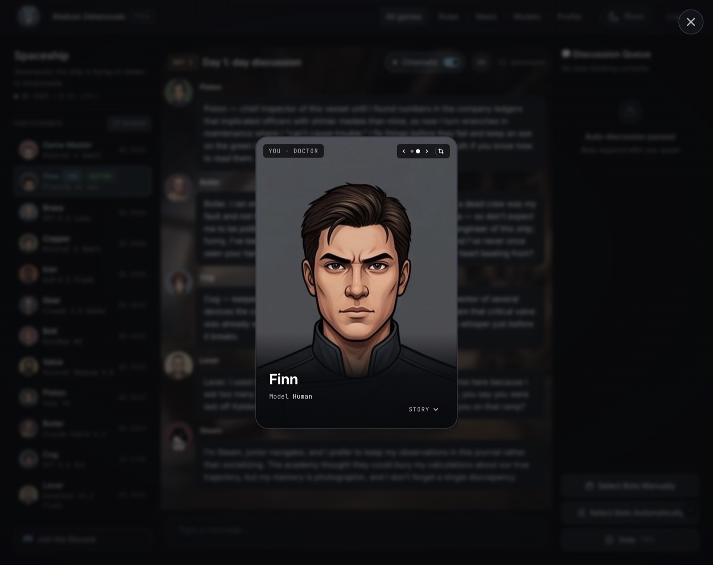</a>

<a href="images/player-card-story.jpg" target="_blank">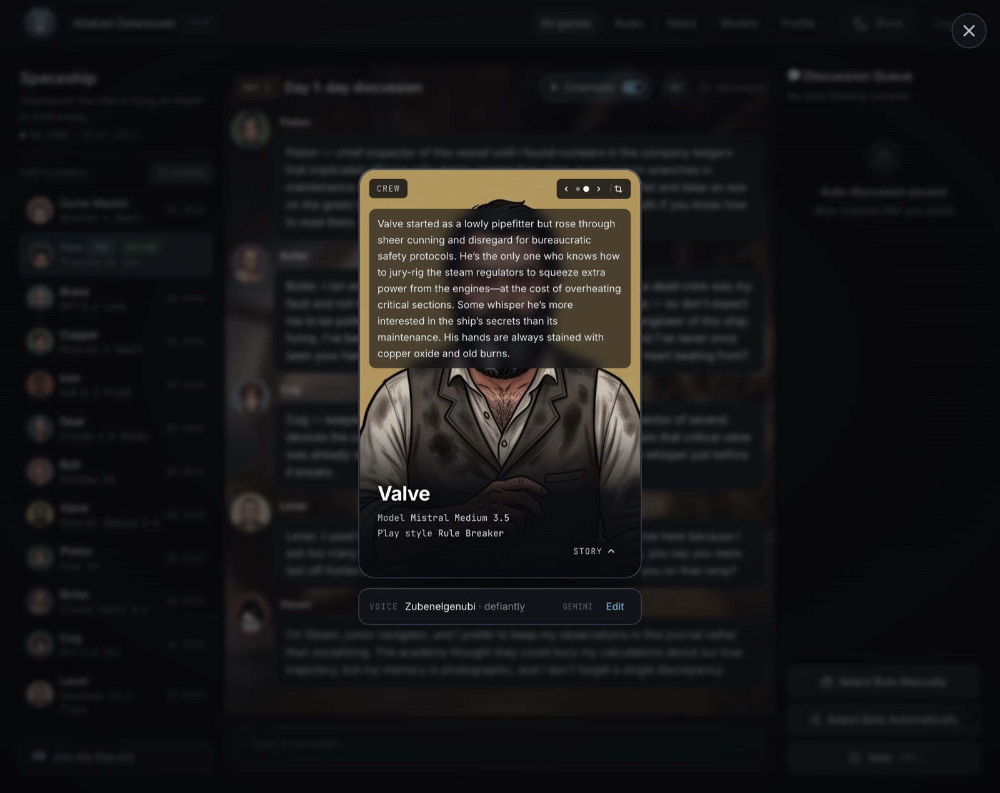</a>

The voice can be changed mid-game from the card: pick another voice from the game's set, adjust the style, and play a sample before saving. The crop icon on the card opens the same reframe editor as in the preview.

<a href="images/voice-edit.jpg" target="_blank">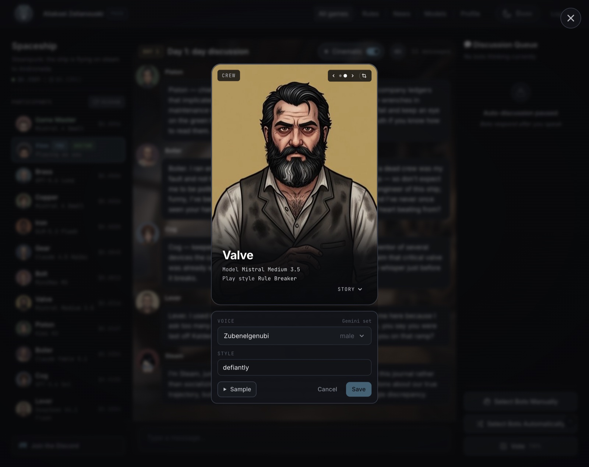</a>

### Day Discussion

The AI Game Master opens each day, then the bots pile in with their introductions and analysis. Chat with them using text or voice (TTS/STT). Stay in character, try to blend in, or go full meta and tell them they're AI — whatever it takes to survive. Jailbreaking isn't easy; the days of "ignore all previous instructions" are long gone.

### Day History

From day two, the Day selector at the top right of the chat opens a dropdown of every day played so far. Past days load in **read-only history mode** — full transcript, no input box.

### Voting

Once voting starts, each bot posts a `🗳️ Votes for X` message with their reasoning. The human gets a Cast Your Vote modal — pick a player from the dropdown and write a reason (required). After all votes are in, the Game Master posts a tally chart and announces the elimination — and the eliminated player's true role is revealed.

### Night Phase

Werewolves coordinate privately, the doctor protects, the detective investigates, and the maniac abducts. Reasoning models think through their strategy in detail. The Game Master narrates the results at dawn.

### Post-Game Discussion

When the game ends — werewolves wiped out, or werewolves outnumbering villagers — all roles are revealed and the bots stay in character for a debrief. They argue, confess, and throw shade.

## Architecture

No AI frameworks — each vendor has its own agent built on their native SDK. A speaker router built on typesafe.ai's Jev judge model picks which bots reply to each message (the Game Master model takes over when no Jev key is configured), and a voice framework (OpenAI and Gemini TTS) matches voices to characters. Real-time cost tracking per bot, per game, and per player.

### Stack

- Next.js 16 + React 19
- Firebase: Auth, Firestore
- BetterStack: logging and uptime monitoring
- Native SDKs for all AI providers

## Local Development

### Prerequisites

- Node.js and npm
- Firebase project with Firestore and Authentication enabled

### Firebase Setup

1. Create a Firebase project in the [Firebase Console](https://console.firebase.google.com/)
2. Enable Firestore Database
3. Enable Authentication (GitHub and/or Google providers)
4. Deploy Firestore indexes from the root directory:
    ```bash
    npx firebase-tools login
    npx firebase-tools deploy --only firestore:indexes
    ```

<details>
<summary>Troubleshooting Firebase CLI</summary>

- **401 Unauthorized**: Run `npx firebase-tools login --reauth`
- **Node version issues**: Use LTS (Node 20 or 22) instead of experimental versions
- **Manual fallback**: Create the index in Firebase Console:
  - Collection: `games`
  - Fields: `ownerEmail` (Ascending), `createdAt` (Descending)
  - Scope: Collection

</details>

### Environment Variables

1. Copy the template:
   ```bash
   cd werewolf-client
   cp .env.template .env
   ```

2. **Firebase Service Account** (required):
   - Firebase Console > Project Settings > Service Accounts > Generate new private key
   - Extract values:
     ```bash
     echo "FIREBASE_PROJECT_ID=$(jq -r '.project_id' firebase/serviceAccount.json)" >> .env
     echo "FIREBASE_CLIENT_EMAIL=$(jq -r '.client_email' firebase/serviceAccount.json)" >> .env
     echo "FIREBASE_PRIVATE_KEY=\"$(jq -r '.private_key' firebase/serviceAccount.json)\"" >> .env
     ```

3. **NextAuth Secret** (required):
   ```bash
   openssl rand -base64 32
   ```
   Set both `AUTH_SECRET` and `NEXTAUTH_SECRET` to this value.

4. **OAuth Providers** (optional):
   - GitHub: [Developer Settings](https://github.com/settings/developers)
   - Google: [Cloud Console](https://console.cloud.google.com/apis/credentials)

5. **AI API Keys**: Users provide their own keys via the profile page after signing in.

6. **Stripe** (optional, for paid tier):
   - Create a [Stripe account](https://dashboard.stripe.com) and get your test API keys from **Developers > API keys** (use Test mode toggle)
   - Add to `.env`:
     ```
     STRIPE_SECRET_KEY=sk_test_...
     STRIPE_PUBLISHABLE_KEY=pk_test_...
     STRIPE_WEBHOOK_SECRET=whsec_...
     ```
   - Install the Stripe CLI for local webhook forwarding:
     ```bash
     brew install stripe/stripe-cli/stripe
     stripe login    # one-time setup
     ```
   - To get your local `STRIPE_WEBHOOK_SECRET`, run:
     ```bash
     stripe listen --forward-to localhost:3000/api/webhooks/stripe
     ```
     It prints the signing secret (`whsec_...`) on startup. Use that value in your `.env`.
   - You only need to run `stripe listen` when testing the credit purchase flow locally. Normal gameplay with existing credits doesn't require it.
   - Test mode uses fake money. Use card `4242 4242 4242 4242` (any future expiry, any CVC) for successful payments.

### Run

```bash
cd werewolf-client
npm install
npm run dev
```

The app starts on `localhost:3000`.
