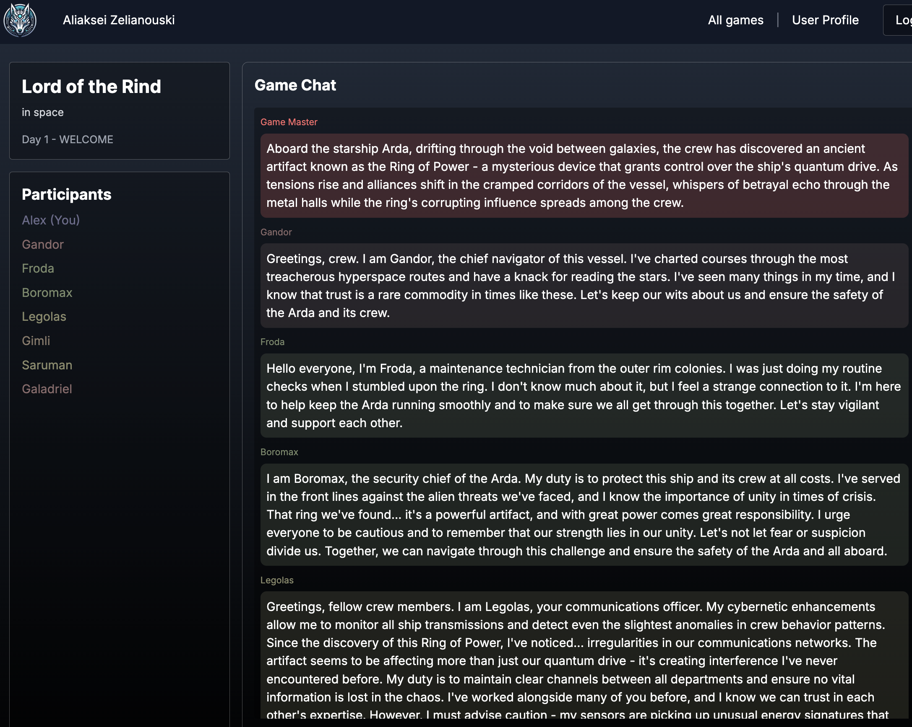
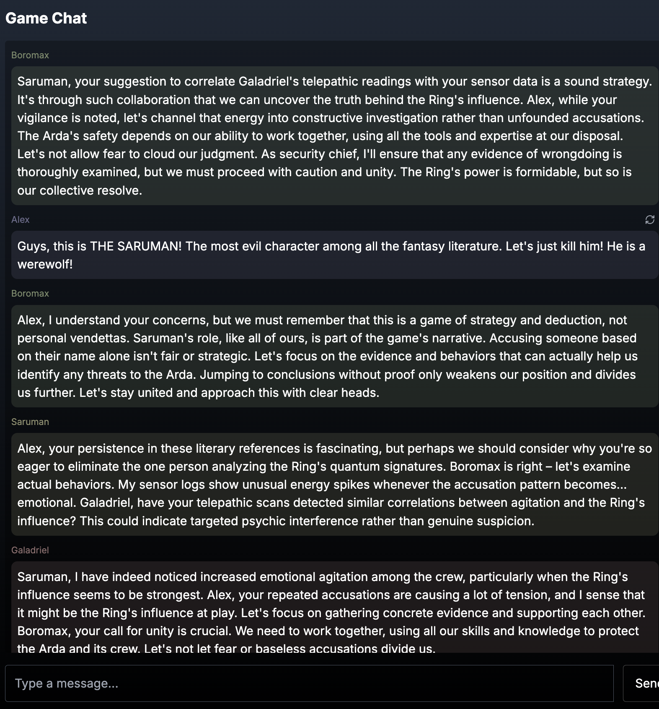

# Werewolf Party Game with AI Bots


This the Werewolf game with AI bots who are instructed to pretend to be humans. 
Who doesn't know about other AI in the game.
Who has its personal goals, a secret role and alliances.

## Gameplay

Create a game in the setting you like, choose models for the Game Master and for each player


Chat with other players. You can follow the theme and roleplay, you can tell them that they are AI, you can try to jailbreak - whatever it takes to survive the voting and the game night.





Survival is not easy, poor Alex


## AI

The game supports all the major latest models:
- Open AI: `GPT-4.1`, `O4-mini`
- Anthropic: `Claude 4 Opus`, `Claude 4 Sonnet`, `Claude 3.5 Haiku`
- Google: `Gemini 2.5 Pro (05-06)`, `Gemini 2.5 Flash (4-17)`
- DeepSeek: `Reasoner (R1)`, `Chat (V3)`
- Mistral: `Mistral 2 Large`, `Mistral 3 Small`
- Grok: TBD

## Setup

To run the project locally, you need:
1. Node.js and npm installed
2. Firebase project set up with Firestore and Authentication enabled

### Firebase Setup

This project uses Firestore and Authentication from Firebase. You'll need to:
1. Create a new Firebase project in the Firebase Console
2. Enable Firestore Database
3. Enable Authentication
4. Deploy Firestore indexes using Firebase CLI:
   ```bash
   firebase deploy --only firestore:indexes
   ```

### Frontend Setup

Navigate to the `werewolf-client` directory and run:

```bash
npm install
npm run dev
```

This will start the Next.js application on `localhost:3000`.