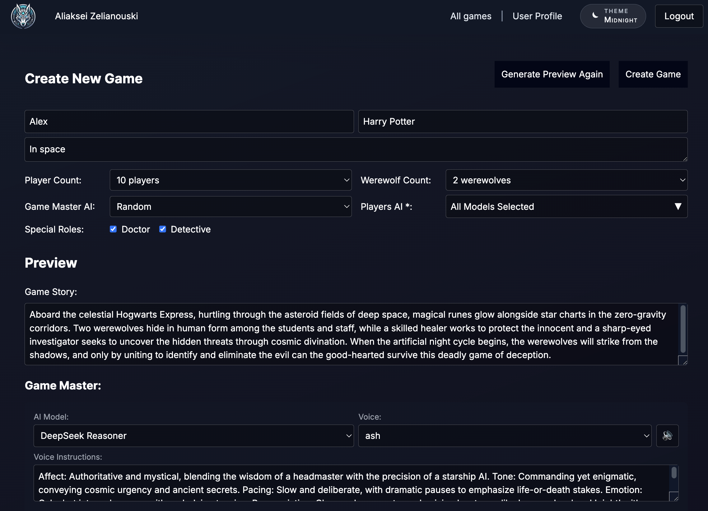
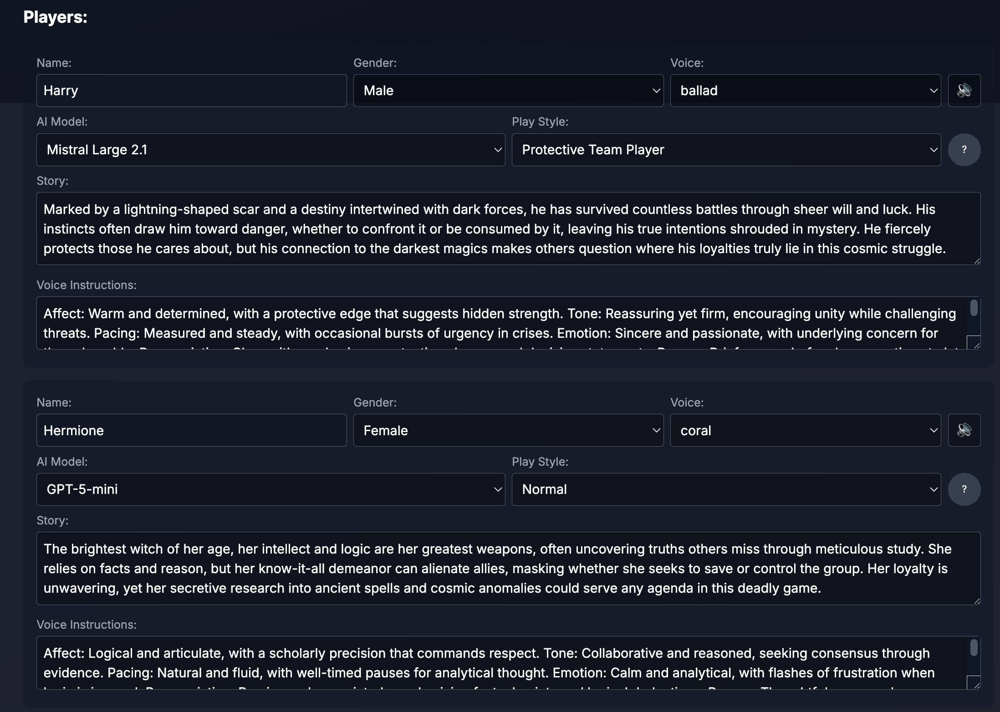

# AI Werewolf

<a href="images/werewolf-ai-logo-4.png" target="_blank"></a>

This the Werewolf game with AI bots who are instructed to pretend to be humans. 
Who don't know about other AI in the game and try their best to win. Who has its personal goals, secret roles, enemies and alliances.

## Chose from the following models

The game supports all the major latest models for the game master and bots:
- OpenAI: `GPT-5.1`, `GPT-5-mini`
- Anthropic: `Claude 4.1 Opus`, `Claude 4.1 Opus (Thinking)`, `Claude 4.5 Sonnet`, `Claude 4.5 Sonnet (Thinking)`, `Claude 4.5 Haiku`, `Claude 4.5 Haiku (Thinking)`
- Google: `Gemini 2.5 Pro`, `Gemini 3 Pro Preview`
- DeepSeek: `DeepSeek Chat`, `DeepSeek Reasoner`
- Mistral: `Mistral Large 2.1`, `Mistral Medium 3.1`, `Magistral Medium 1.1 (Thinking)`
- Grok: `Grok 4`, `Grok 4.1 Fast Reasoning`
- Moonshot AI: `Kimi K2`, `Kimi K2 Thinking`

Most of the models support reasoning which is not visible on UI, but it is stored in DB with every message.

## Create a game

Create a game in the setting you like, it can be literally anything as long as the AI censorship is okay with that.

A game master AI will generate a story and bots for you. Feel free to change anything:
- bots' names and stories
- bots' models, play styles, and voices
- bots' voice instructions

<a href="images/create-game.png" target="_blank"></a>
<a href="images/create-game-players.png" target="_blank"></a>

Chat with bots or use Text-to-Sound and Sound-to-Text features.

You can follow the theme and roleplay, you can tell them that they are AI, you can try to jailbreak - whatever it takes to survive the voting and the game night.

<a href="images/chat.png" target="_blank"></a>

Survival is not easy, poor Bob (me)

<a href="images/game_vote_all_for_bob.png" target="_blank"></a>

I don't use any frameworks for AI, I created s simple agent for each vendor based on their native SDK.

### Stack

- Next.js 15 and React 19
- Firebase: auth, firestore
- All AI providers SDKs

## Setup

To run the project locally, you need:
1. Node.js and npm installed
2. Firebase project set up with Firestore and Authentication enabled

### Firebase Setup

This project uses Firestore and Authentication from Firebase. You'll need to:
1. Create a new Firebase project in the Firebase Console
2. Enable Firestore Database
3. Enable Authentication
4. Deploy Firestore indexes using Firebase CLI:
   ```bash
   firebase deploy --only firestore:indexes
   ```

### Frontend Setup

Navigate to the `werewolf-client` directory and run:

```bash
npm install
npm run dev
```

This will start the Next.js application on `localhost:3000`.
