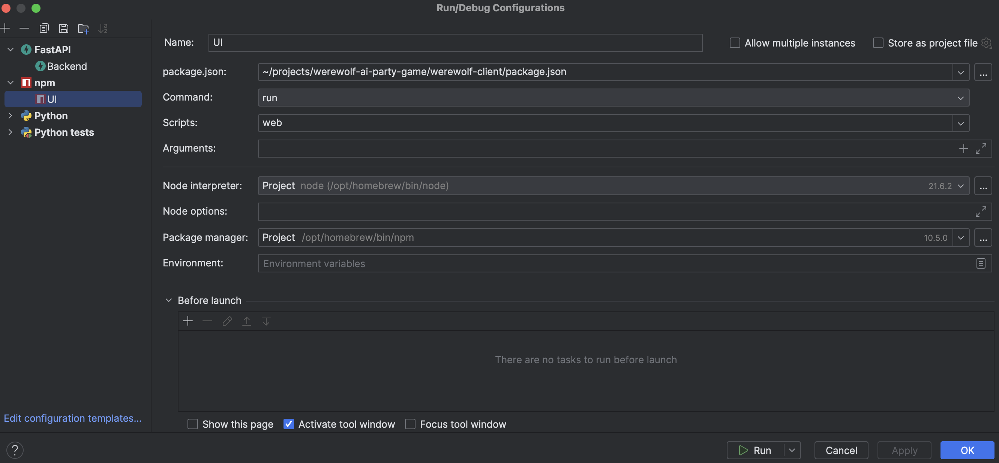

# Werewolf Party Game with AI Bots


> [!IMPORTANT]  
> I'm reworking the app to the Next.js + Firebase stack. I'm throwing away the Python backend because I feel like switching to Next.js simplifies things a lot. It's a common app for both frontend and backend. Firebase gives me a database for games and chat messages which is easier to use than DynamoDb. Firebase also provides authentication and hosting.
> I plan to complete the redesign in 1-2 weeks. So far all the work in going on in the `nextjs-with-firebase` branch.

I created this repo for the Backdrop Build V3 hackathon on February 26, 2024. It was based on my other project [mafia-gpt](https://github.com/hiper2d/mafia-gpt). Mafia used OpenAI Assistants API which disappointed me a lot in process of development (slow, native client freezes randomly, outages on the OpenAI side), so I replaced it with a pure completion API. This gave me flexibility to switch between models (GPT-4, Claude3 Opus, Mistral Large, Grok 1.5 for now) but forced to store the chat history in DynamoDB. I like this approach so I deprecated mafia-gpt in favor of this repo.

All projects registry: [Builds](https://backdropbuild.com/builds)

The event project page: [ai-werewolf](https://backdropbuild.com/v3/ai-werewolf)

# Gameplay

What is nice about this game is complete freedom in the themes and roleplay. You can create any setting you want. A movie, a book, any historical period, or even a completely new world. The game is very flexible and can be adapted to any setting. 

Here is an example of the "Terminator" theme:


Or "Lord of the Rings":


I really like these thematic dialogs and how creative the bots are. 

UI is chunky and ugly yet but I'm working on it. It's a very early stage of the project. It is only possible to create a new game, to chat with bot players and to initiate a first round of voting. I have more things in the API but UI is not ready yet.

# Setup

To run the project locally, you need:
- Install Docker and Docker Compose, run local DynamoDb with `docker-compose up`
- Frontend: install node.js and npm, install dependencies with `npm install`, and run the app by `npm run web`
- Backend: install Python 3.11+ and Pypenv, install dependencies with `pipenv install`, and run the FastAPI server

### DynamoDB

I prefer to run it with Docker Compose. There is a firebase in the root directory, just run it. You need to have docker
and docker-compose installed.

```bash
docker-compose up
```

### Backend

Install Python 3.11+ and Pipenv.

I use FastAPI Python web server and React Native frontend application. Here are my Intellij Idea run configurations:




> **Note:** Before running Python code, rename the [.env.template](.env.template) file into `.env` and fill in the values. All
environmental variables from it will be loaded by functions and used to talk to the external APIs (DynamoDB, OpenAI).

### Run Python functions [deprecated as I already have UI]

I don't have any better runner than Python junit tests for now. In future, I'll use a web server with UI in React Native
for the local development. I'll deploy functions to Lambdas and host UI somewhere separately.
Each function has a separate test. It does not make sense to run all of them, only for the function you want to run.
To run tests, install Python dependencies using `Pipenv` (more details about it is [below](#pipenv_setup)), then run a
test you need like this:

   ```bash
   python -m unittest test_lambda_functions.TestGameFunctions.test_init_game
   ```

### <a id="pipenv_setup"></a>Pipenv setup and dependency installation

I use `pipenv` to manage dependencies. Install it, create a virtual environment, activate it and install dependencies.

1. Install `pipenv` using official [docs](https://pipenv.pypa.io/en/latest/install/#installing-pipenv). For example, on
   Mac:
    ```bash
    pip install pipenv --user
    ```

2. Add `pipenv` to PATH if it's not there. For example, I had to add to the `~/.zshrc` file the following line:
    ```bash
    export PATH="/Users/hiper2d/Library/Python/3.11/bin:$PATH"
    ```

3. Install packages and create a virtual environment for the project:
    ```bash
    cd <project dir> # navigate to the project dir
    pipenv install
    ```
   This should create a virtual environment and install all dependencies from `Pipfile.lock` file.

   If for any reason you need to create a virtual environment manually, use the following command:
    ```bash
    pip install virtualenv # install virtualenv if you don't have it
    virtualenv --version # check if it's installed
    cd <virtualenv dir> # for example, my virtual envs as here: /Users/hiper2d/.local/share/virtualenvs
    virtualenv <virtualenv name> # I usually use a project name
    ```

4. To swtich to the virtual environment, use the following command:
    ```bash
    cd <project dir>
    pipenv shell
    ```
   If this fails, then do the following:
    ```bash
    cd <virtualenv dir>/bin
    source activate
    ```

### Frontend

Install node.js and npm. Navigate to the `werewolf-client` and run:

```bash
npm install
npm run web
```

This will start the frontend on the `localhost:8081` address. 

# Setup(Windows)

To run the project locally, you need:
- Install Docker and Docker Compose, run local DynamoDb with `docker-compose up`
- Backend: install Python 3.11+
- Frontend: install node.js and npm, navigate to the `werewolf-client` install dependencies with `npm install`, and run the app by `npm run web` 
- Edit environment variables in control panel and add two environment variables to python in PATH, for example: 
```bash
..\AppData\Local\Programs\Python\Python312
..\AppData\Local\Programs\Python\Python312\Scripts
```
- Install dependencies in root directory `pip install -r requirements.txt`
- Inside `.env` file add keys and add AWS_ACCESS_KEY_ID and AWS_SECRET_ACCESS_KEY, remove AWS_PROFILE:

```bash
AWS_ACCESS_KEY_ID=DUMMYIDEXAMPLE
AWS_SECRET_ACCESS_KEY=DUMMYEXAMPLEKEY
```
- From `server` folder run web server: `uvicorn local_server:app --reload`

