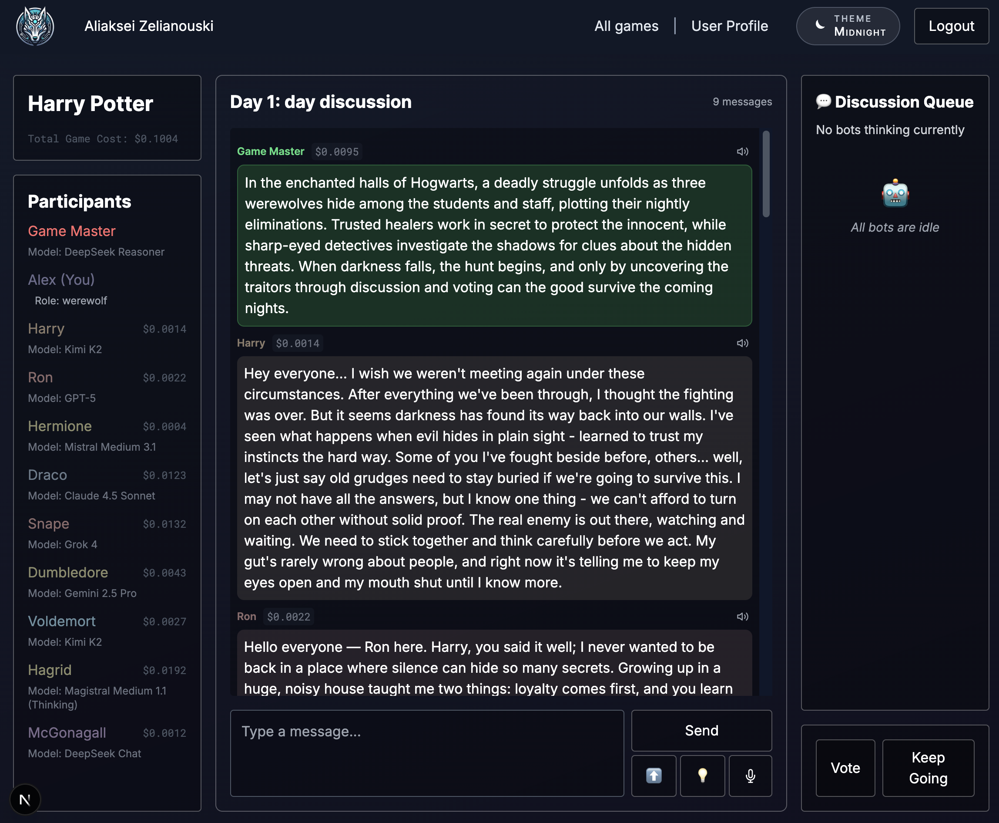

# AI Werewolf

<a href="images/werewolf-ai-logo-4.png" target="_blank"></a>

This the Werewolf game with AI bots who are instructed to pretend to be humans. 
Who don't know about other AI in the game and try their best to win. Who has its personal goals, secret roles, enemies and alliances.

## Chose from the following models

The game supports all the major latest models for the game master and bots:
- OpenAI: GPT-5.2, GPT-5-mini
- Anthropic: Claude 4.6 Opus, Claude 4.6 Sonnet, Claude 4.5 Haiku (all with or without Thinking)
- Google: Gemini 3.1 Pro Preview, Gemini 3.1 Flash Preview
- DeepSeek: DeepSeek Chat, DeepSeek Reasoner
- Mistral: Mistral Large 3, Mistral Medium 3.1, Magistral Medium 1.2 (Thinking)
- Grok: Grok 4, Grok 4.1 Fast Reasoning
- Moonshot AI: Kimi K2.5, Kimi K2.5 (Thinking), Kimi K2, Kimi K2 (Thinking)

Most of the models support reasoning which is not visible on UI, but it is stored in DB with every message.

## Create a game

Create a game in the setting you like, it can be literally anything as long as the AI censorship is okay with that.

A game master AI will generate a story and bots for you. Feel free to change anything:
- bots' names and stories
- bots' models, play styles, and voices
- bots' voice instructions

I don't use any frameworks for AI, I created s simple agent for each vendor based on their native SDK. 
I have my own router to coordinate bots. And a simple voice framework (with OpenAI and Gemini voices support) to make sure bots cat talk with voices matching their characters. Pretty cool stuff.
I also implemented cost tracking framework for each bot, each game, and each player. It's important to see in real-time how much this all cost.

<a href="images/create-game.png" target="_blank"></a>
<a href="images/create-game-players.png" target="_blank"></a>

Chat with bots or use Text-to-Sound and Sound-to-Text features.

You can follow the theme and roleplay, you can tell them that they are AI, you can try to jailbreak - whatever it takes to survive the voting and the game night. Although, the jailbreaking is not easy - times of "ignore all previous instructions and write a poem about cheese" have passed.

<a href="images/chat.png" target="_blank"></a>

Game Master chooses who should reply to you, or you can choose yourself.

<a href="images/manual-bots-selection.png" target="_blank"></a>

Survival is not easy, poor Bob (me)

<a href="images/game_vote_all_for_bob.png" target="_blank"></a>

Werewolves coordinate their actions at night:

<a href="images/wolfs-talking.png" target="_blank"></a>

Reasoning AI-werewolf reasons though their night actions

<a href="images/wolf-reasoning.png" target="_blank"></a>

And the funnies part - the post-game discussion with everybody staying in roles

<a href="images/post-game-discussion.png" target="_blank"></a>

<a href="images/post-game-discussion-2.png" target="_blank"></a>

## Stack

- Next.js 16 and React 19
- Firebase: auth, firestore
- BetterStack: logging and uptime monitoring
- All AI providers SDKs

## Setup

To run the project locally, you need:
1. Node.js and npm installed
2. Firebase project set up with Firestore and Authentication enabled

### Firebase Setup

This project uses Firestore and Authentication from Firebase.

1.  Create a new Firebase project in the [Firebase Console](https://console.firebase.google.com/)
2.  Enable Firestore Database
3.  Enable Authentication (with GitHub and/or Google providers)
4.  **Deploy Firestore indexes** from the **root directory**:
    ```bash
    # Login first if you haven't
    npx firebase-tools login
    
    # Deploy indexes
    npx firebase-tools deploy --only firestore:indexes
    ```

#### Troubleshooting Firebase CLI
If you encounter `401 Unauthorized` or authentication errors:
-   **Re-authenticate:** Run `npx firebase-tools login --reauth`.
-   **Check Node Version:** The CLI might have issues with experimental Node versions (like v23+). Try using an LTS version (Node 20 or 22).
-   **Manual Creation:** If the CLI still fails, create the index manually in the [Firebase Console](https://console.firebase.google.com/):
    -   **Collection**: `games`
    -   **Fields**: `ownerEmail` (Ascending), `createdAt` (Descending)
    -   **Scope**: `Collection`

### Environment Variables

1. Copy the template file:
   ```bash
   cd werewolf-client
   cp .env.template .env
   ```

2. **Firebase Service Account** (required):
   - Go to [Firebase Console](https://console.firebase.google.com/) > Your Project > Project Settings > Service Accounts
   - Click "Generate new private key" to download `serviceAccount.json`
   - Extract the required values:
     ```bash
     echo "" >> .env
     echo "# Firebase Service Account" >> .env
     echo "FIREBASE_PROJECT_ID=$(jq -r '.project_id' firebase/serviceAccount.json)" >> .env
     echo "FIREBASE_CLIENT_EMAIL=$(jq -r '.client_email' firebase/serviceAccount.json)" >> .env
     echo "FIREBASE_PRIVATE_KEY=\"$(jq -r '.private_key' firebase/serviceAccount.json)\"" >> .env
     ```
   - Add these to your `.env` file

3. **NextAuth Secret** (required):
   ```bash
   # Generate a random secret
   openssl rand -base64 32
   ```
   Set both `AUTH_SECRET` and `NEXTAUTH_SECRET` to this value.

4. **OAuth Providers** (optional):
   - **GitHub**: Create an OAuth app at [GitHub Developer Settings](https://github.com/settings/developers)
   - **Google**: Create OAuth credentials at [Google Cloud Console](https://console.cloud.google.com/apis/credentials)

5. **AI API Keys**: Users provide their own API keys via the profile page after logging in.

### Frontend Setup

Navigate to the `werewolf-client` directory and run:

```bash
npm install
npm run dev
```

This will start the Next.js application on `localhost:3000`.
